# Bauhaus Hands

A native macOS clock screensaver with **six independently selectable hand styles**, eleven dial designs, and Day / Night / System appearance.

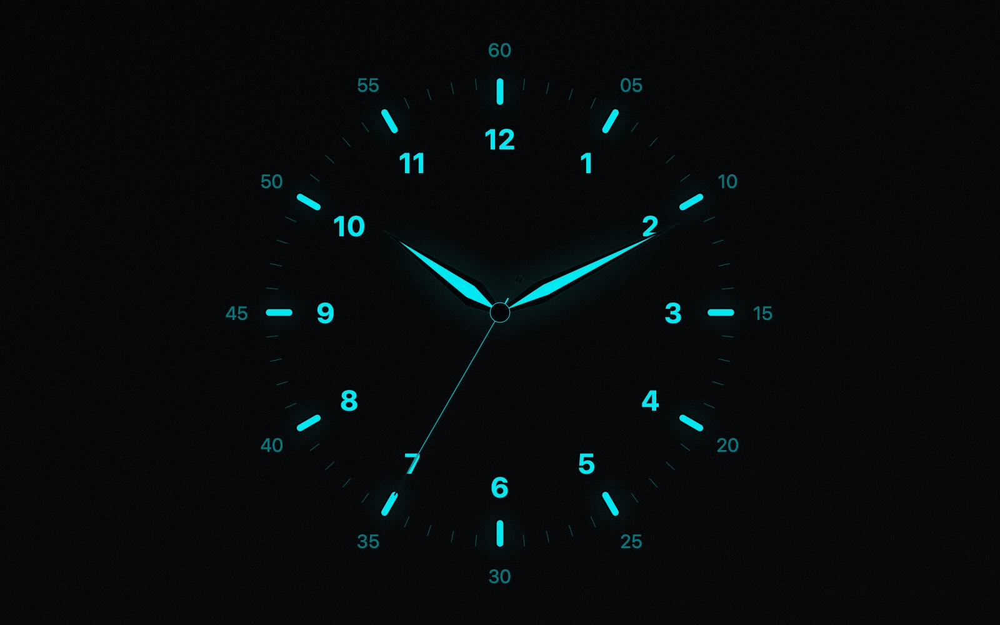

**[Website & interactive gallery](https://ahmadfaridabbas.github.io/bauhaus-clock/)** · **[Download v1.0.0](docs/downloads/BauhausHands-1.0.0.zip)** · macOS 15.5+ · Intel and Apple Silicon

## Hand styles

Choose a different style for each of the hour, minute, and second hands:

| Original | Baton | Dauphine |
| --- | --- | --- |
| 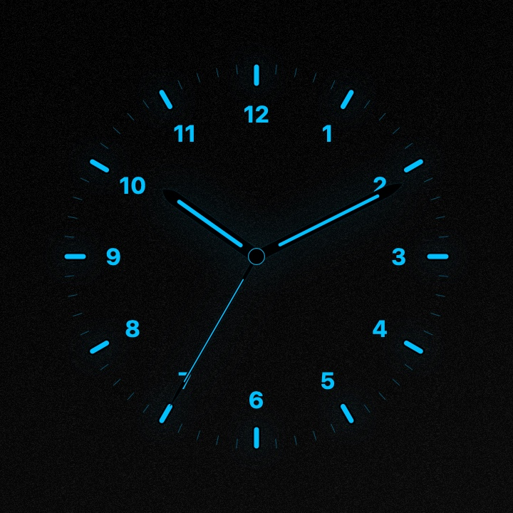 | 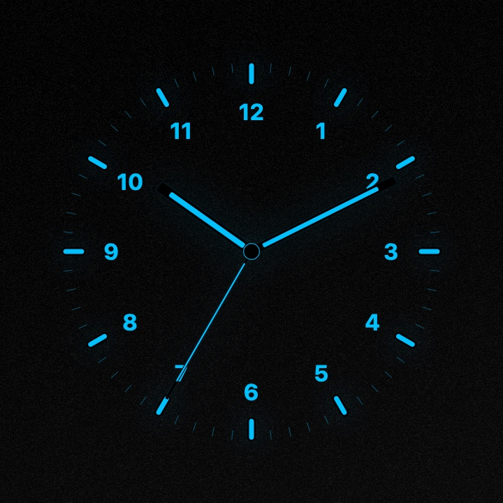 | 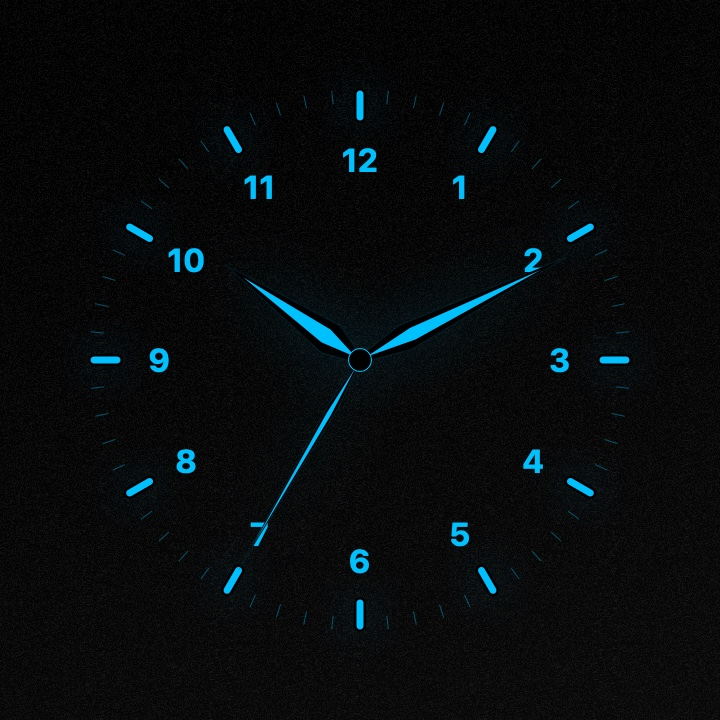 |

| Leaf | Sword | Needle |
| --- | --- | --- |
| 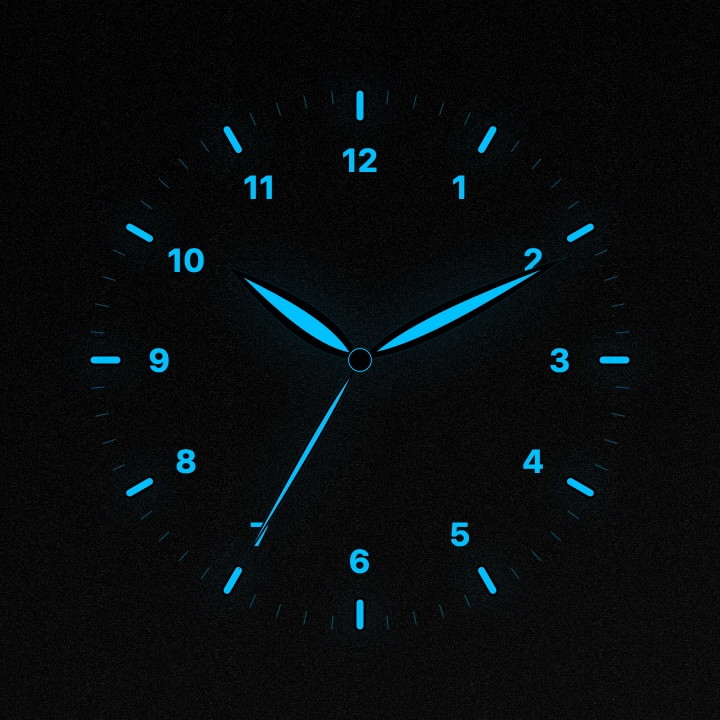 | 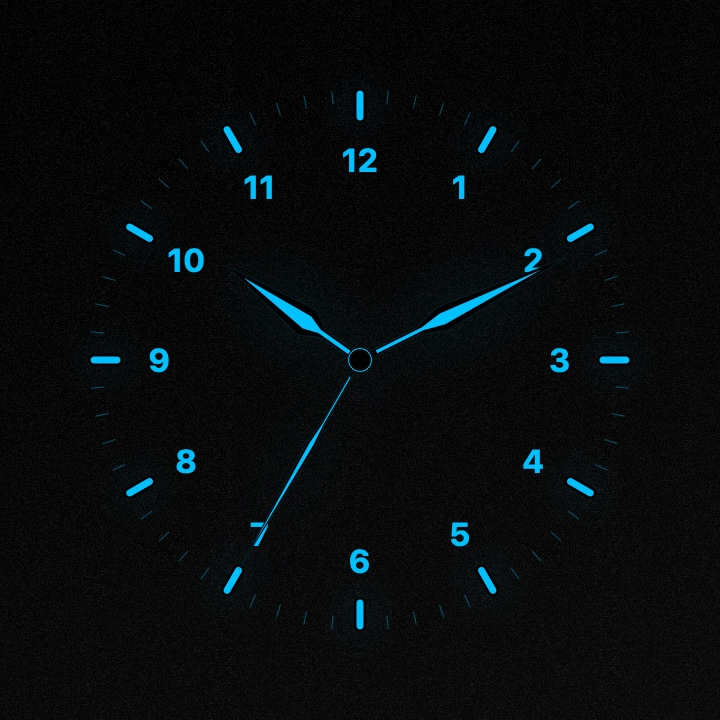 | 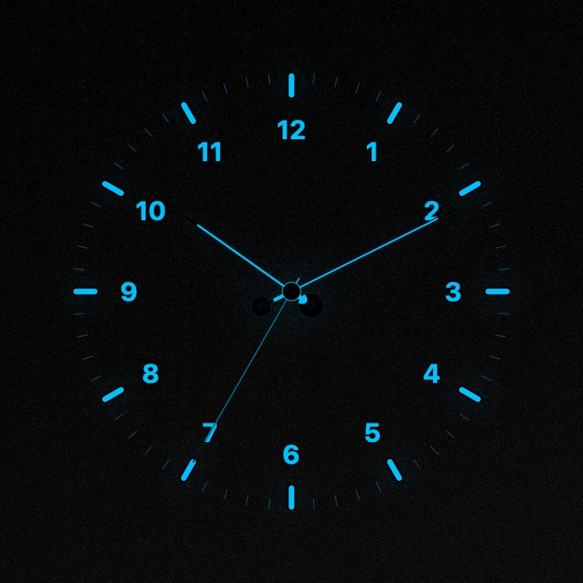 |

The default pairs Dauphine hour and minute hands with a Needle second hand.

## Dial gallery

| Turquoise · Baton | Ivory · Leaf | Ocean · Sword |
| --- | --- | --- |
| 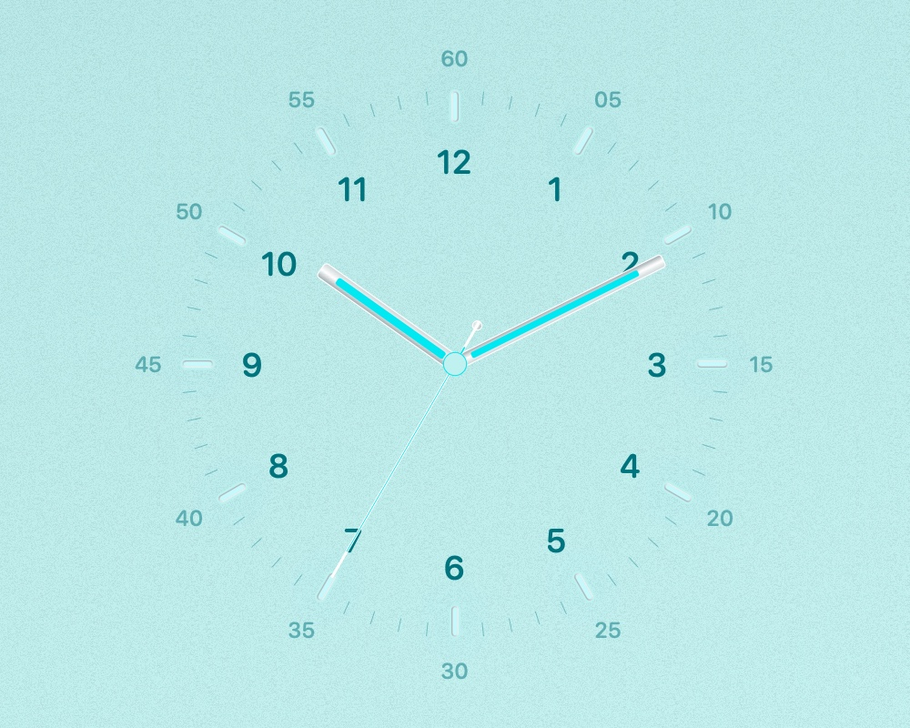 | 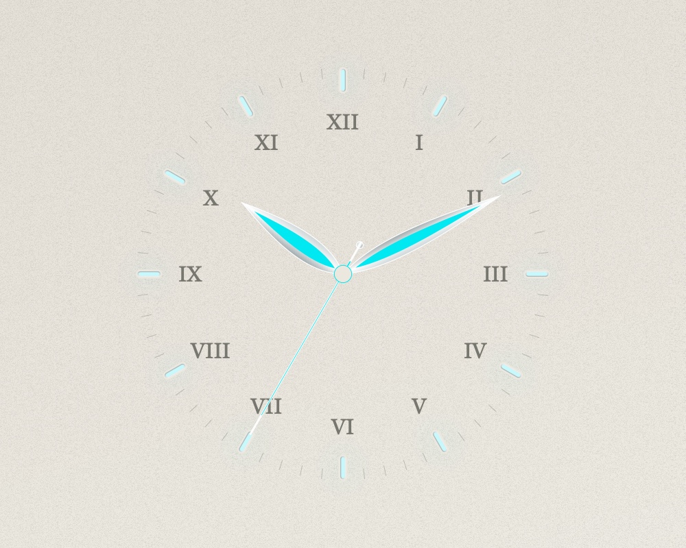 | 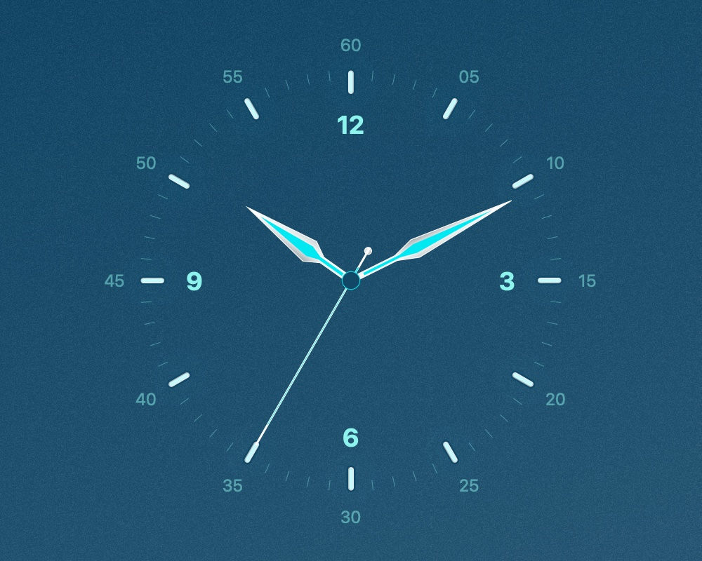 |

| Rose · Dauphine | Noir · Dauphine | White · Baton |
| --- | --- | --- |
| 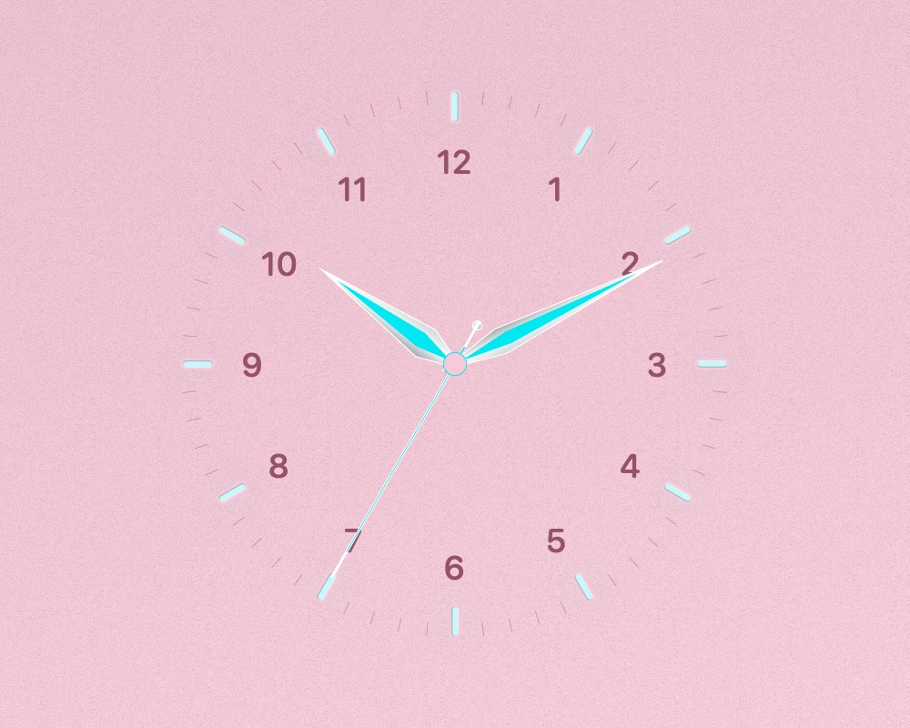 | 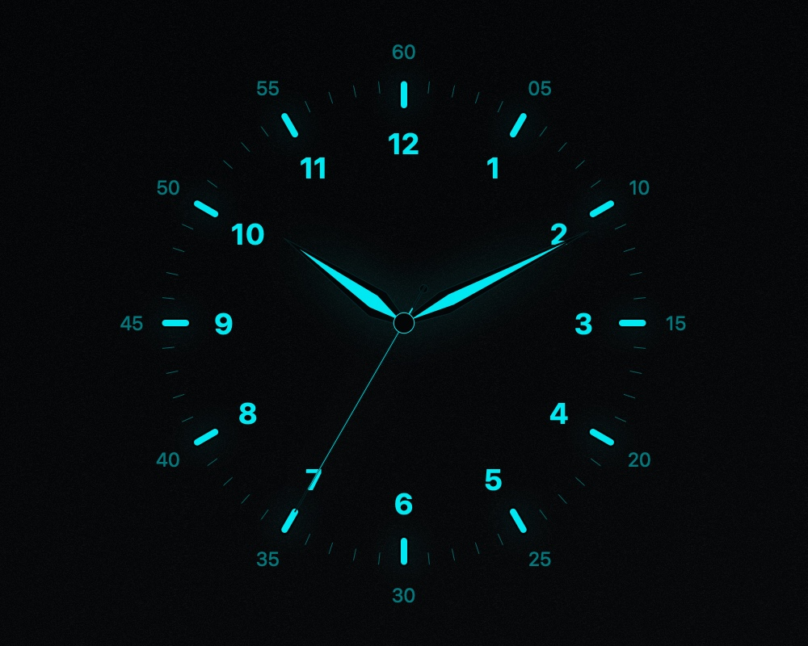 | 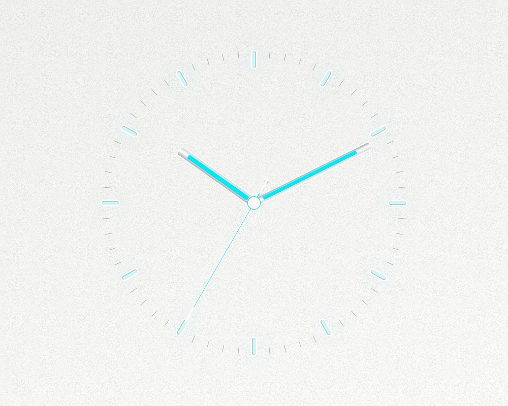 |

Gallery images are native offscreen renders at 10:10:35, produced from the screensaver's drawing code. They are not photographs or captures of System Settings.

## Features

- Original, White, Turquoise, Glacier, Ocean, Tennis, Rose, Sky, Ivory, Graphite, and Noir dials.
- Day, Night, or automatic System appearance.
- Quartz, Mechanical (eight steps per second), and Smooth hand movement.
- Arabic, Roman, quarter-hour-only, or no numerals; four typography choices.
- Nine palette choices on the Original dial, custom colors, lume swatches, and glow control.
- Optional second hand, outer minute numbers, and rotated minute labels.
- Adjustable clock size, paper texture, and a live settings preview.
- Save, Cancel, and Reset appearance controls.

## Install

1. Download and extract [BauhausHands-1.0.0.zip](docs/downloads/BauhausHands-1.0.0.zip).
2. Double-click `BauhausHands.saver` and follow the macOS installation prompt.
3. Select **Bauhaus Hands** under Screen Saver in System Settings.
4. Open **Options** to choose each hand style and customize the dial, then click **Save**.

This is a locally signed build, not an Apple-notarized distribution. macOS may request approval in Privacy & Security. It uses its own preferences and can coexist with the original Bauhaus screensaver.

**Known Tahoe issue:** Options may stop opening after leaving the preview with Done. Quit and reopen System Settings, then open Options again. Native rendering, settings behavior, universal compilation, and signature verification have been tested; installation and System Settings hosting have not been fully validated.

## Build from source

Requires macOS and Apple Command Line Tools (`xcode-select --install`). No third-party libraries or Xcode project are required.

```sh
bash src/build.sh
```

Creates `BauhausHands.saver` at the repository root, with both `arm64` and `x86_64` architectures and a local ad-hoc signature.

To rebuild the website's downloadable ZIP:

```sh
bash scripts/package-release.sh
```

To regenerate the native screenshots:

```sh
bash scripts/render-screenshots.sh
```

The renderer uses a temporary source copy with a fixed display time. The shipped screensaver always displays the current time.

To run the settings and rendering checks:

```sh
bash scripts/verify.sh
```

## GitHub Pages website

The complete static website lives in `docs/`. No dependency installation, API keys, or site build is needed. See **[PUBLISHING.md](PUBLISHING.md)** for uploading this folder and enabling the website. All site paths are relative, so they work under any repository name.

For a local preview:

```sh
python3 -m http.server 8080 --directory docs
```

Then open `http://localhost:8080`.

## Credits and licensing status

Based on [BauhausScreensaver](https://github.com/aryanranderiya/BauhausScreensaver) by **Aryan Randeriya**, with subsequent appearance/settings customizations and independent hand styles. Original author notices are retained in the source. This is an independent customization.

No explicit license file was found in the upstream repository when preparing this package. This package does not invent or replace the upstream licensing terms. See [THIRD_PARTY_NOTICES.md](THIRD_PARTY_NOTICES.md).
